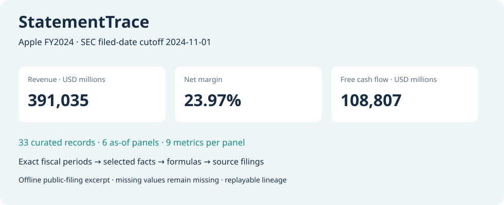

# StatementTrace

[](https://github.com/dev-belly/StatementTrace/actions/workflows/ci.yml)


**Public financial statements with exact fiscal periods, filing-date cutoffs and traceable financial metrics.**

Which numbers were publicly filed by this cutoff, and which records produced this ratio? StatementTrace answers with a reproducible report from SEC CompanyFacts-shaped JSON. The offline demo uses **33 manually curated records from Apple's 2023/2024 Form 10-K tables**; it is not an unmodified API download.

**[Try the live financial report](https://dev-belly.github.io/StatementTrace/)** · [中文面试讲解](docs/INTERVIEW.md)



## Quick start

```bash
git clone https://github.com/dev-belly/StatementTrace.git
cd StatementTrace
python -m venv .venv
source .venv/bin/activate
python -m pip install -e .
statementtrace demo --out output/demo
statementtrace verify output/demo
python -m http.server 8000 --directory output/demo
```

For **Windows PowerShell**, use the virtual environment directly; activation is optional:

```powershell
git clone https://github.com/dev-belly/StatementTrace.git
cd StatementTrace
python -m venv .venv
.\.venv\Scripts\python.exe -m pip install -e .
.\.venv\Scripts\statementtrace.exe demo --out output/demo
.\.venv\Scripts\statementtrace.exe verify output/demo
.\.venv\Scripts\python.exe -m http.server 8000 --directory output/demo
```

Open `http://localhost:8000`, choose a cutoff and fiscal year, inspect the formulas and follow selected facts to SEC filings. The committed report is in [examples/demo](examples/demo); GitHub displays HTML as source, so download or serve it locally.

## Contracts

| Concern | Behavior |
|---|---|
| Availability | `filed <= as_of`; later filings cannot leak into earlier snapshots |
| Fiscal periods | Exact start/end for duration facts; exact end for instant facts, including 53-week years |
| Comparatives | Match the reported period, rather than the filing's `fy` |
| Units / forms | Integral USD values, annual `10-K`/`10-K/A`; no implicit currency conversion |
| Ambiguity | Conflicting latest same-day facts or aliases fail closed |
| Missing data | Explicit missing-input and zero-denominator statuses; neither becomes zero |
| Lineage | Formula → named input → full fact ID → concept, dates and accession |
| Replay | Hash checks and full recomputation of CSV, JSON, decisions, lineage and HTML |

Nine outputs: net margin, operating margin, cash conversion, current ratio, liability ratio, free cash flow, FCF margin, accounting balance residual and reported annual revenue growth. Fractions preserve exact values; decimal display is rounded. Growth is **not week-normalized**.

## Demo evidence

- FY2024 is unavailable on `2024-10-31` and available on `2024-11-01`.
- FY2023 has 371 inclusive days; FY2024 has 364.
- FY2024 free cash flow is USD **108,807 million**, calculated from operating cash flow minus capex payments.
- At the later cutoff, FY2023 comparative records come from the 2024 filing with unchanged amounts. No actual restatement is claimed.

There are six cutoff/period panels and nine metrics per panel. Missing panels remain visibly missing. `verify` rejects output tampering even when the corresponding hash is updated; it does not authenticate source inputs or detect a coordinated rewrite of all inputs and outputs.

## Saved-input analysis and validation

```bash
statementtrace run --facts companyfacts.json \
  --request src/statementtrace/data/demo_request.json --out output/custom
python -m pip install -e '.[dev]'
python -m unittest discover -s tests -v
ruff check src tests scripts
ruff format --check src tests scripts
statementtrace verify examples/demo
```

Supply the issuer's actual fiscal calendar. Eleven configured US-GAAP concepts and integral USD raw values are supported; this is not a universal XBRL parser. Save external data separately following the [SEC API documentation](https://www.sec.gov/search-filings/edgar-application-programming-interfaces). The demo and verifier need no network access or credentials.

Tests cover time cutoffs, comparative selection, 53-week periods, quarterly exclusions, ambiguity, exact arithmetic, malformed JSON and evidence tampering. An independent SQLite query checks every demo selection. CI runs tests, byte-for-byte committed report replay and installed-wheel smoke tests on Linux Python 3.11–3.13 and Windows Python 3.12. Text files keep LF endings even with Git's Windows `core.autocrlf=true` setting, so a fresh checkout preserves report hashes. The real symlink test requires Windows Developer Mode or elevated privileges; only that test skips if Windows denies link creation.

## 中文说明

公开财报数据处理与财务指标追溯项目，适合金融数据、财报分析与风控实习展示。重点可以讲 **申报截止日、53 周财年、比较期数据、SQL 对照、缺失值契约和指标血缘**。

- [方法与边界](docs/METHODOLOGY.md)
- [公开数据来源](docs/SOURCES.md)
- [三分钟面试讲解](docs/INTERVIEW.md)
- [可复算演示](examples/demo)

Code: MIT. Financial facts retain filing attribution; the license does not relicense third-party filings. No production-service, investment-return or credit-rating claim is made.
